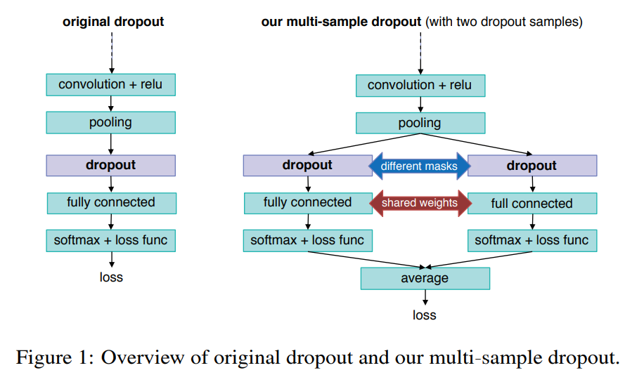
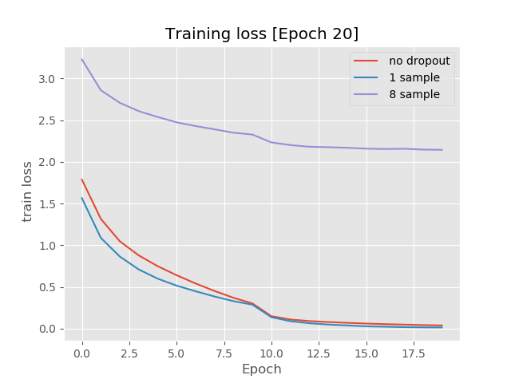
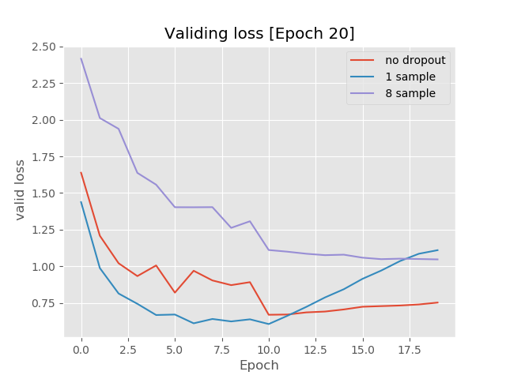
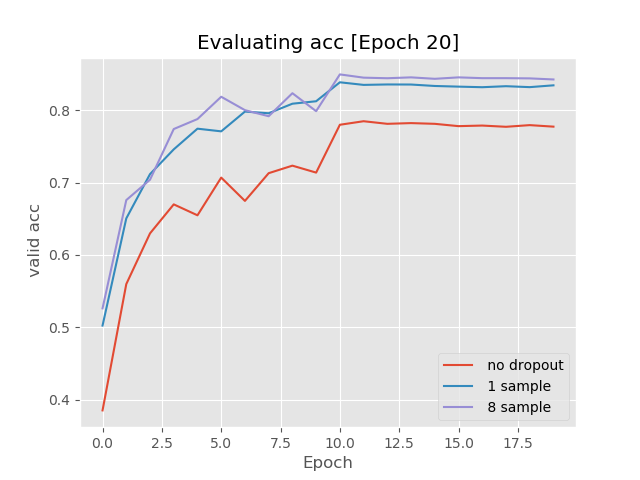

## multi-sample dropout pytorch

a simple pytorch implement of [Multi-Sample Dropout for Accelerated Trainingand Better Generalization](https://arxiv.org/pdf/1905.09788.pdf)

## model 

## example

Data: CIFAR10

Model: MiniResNet

Epochs: 10

Optimizer: Adam

1. Run `python run.py --dropout_num=0` .
2. Run `python run.py --dropout_num=1` .
3. Run `python run.py --dropout_num=8`

## result

### train loss

## valid loss

## valid acc

